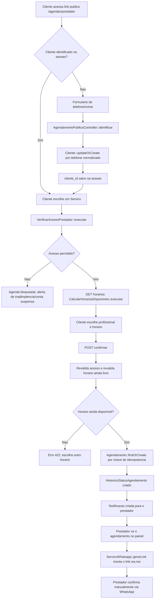

# inServices

SaaS Laravel para gerenciamento e agendamento de servicos com prestadores, profissionais, mensalidades, agenda publica, PWA e contato por WhatsApp sem chat interno.

## Stack

- PHP 8.2
- Laravel 12
- MySQL 8
- Blade, Bootstrap 5, jQuery e Vite
- Queues, Scheduler e estrutura preparada para Broadcasting/Reverb
- PWA com manifest, service worker e ponto de extensao para Web Push
- PHPUnit

## Configuracao local

Crie o banco MySQL:

```sql
CREATE DATABASE in_services CHARACTER SET utf8mb4 COLLATE utf8mb4_unicode_ci;
```

O `.env.example` ja usa:

```env
DB_CONNECTION=mysql
DB_HOST=localhost
DB_DATABASE=in_services
DB_USERNAME=root
DB_PASSWORD=
```

Credenciais do administrador geral devem vir de ambiente:

```env
ADMIN_GERAL_NOME="Administrador Geral"
ADMIN_GERAL_EMAIL="admin@example.com"
ADMIN_GERAL_SENHA="senha-segura"
```

## Comandos

```bash
php artisan migrate --seed
cmd /c npm install
cmd /c npm run build
php artisan test
php artisan serve
```

## Rotas iniciais

- `/painel`: painel do prestador
- `/admin`: painel do administrador geral
- `/agendar/{slug-do-prestador}`: agenda publica
- `/agendar/{slug-do-prestador}/{slug-do-servico}`: horarios por servico
- `/agendar/{slug-do-prestador}/{slug-do-servico}/horarios`: JSON de horarios via AJAX

## Fluxo do sistema

Fluxo principal do produto: agendamento publico feito pelo cliente, do link ate a notificacao do prestador. Detalhamento completo por classe em [`docs/documentacao-fluxo-classes.md`](docs/documentacao-fluxo-classes.md).



## Modulos entregues nesta etapa

- Modelagem principal com planos, assinaturas, mensalidades, pagamentos, prestadores, profissionais, servicos, clientes, dispositivos, agenda, notificacoes, push e auditoria.
- Relacionamento muitos-para-muitos entre `Servico` e `Profissional` com configuracoes por profissional.
- Servico centralizado `ServicoAcessoPrestador` e action `VerificarAcessoPrestador`.
- Calculo inicial de horarios por profissional com multiplas vagas simultaneas.
- Action `AtribuirProfissionalDisponivel` com distribuicao deterministica por menor carga mensal.
- Normalizacao de telefone e geracao segura de link WhatsApp por `ServicoWhatsapp`.
- Layout responsivo com menu lateral, mobile overlay, cards, tabelas responsivas e estados vazios.
- PWA inicial sem cache de areas administrativas, APIs privadas ou dados pessoais.
- Seed demo com prestador `demo`, servico, profissionais e horarios.

## Proximas etapas

1. Autenticacao completa, policies e middleware de isolamento por prestador.
2. CRUDs completos de servicos, profissionais, regras e excecoes de disponibilidade.
3. Fluxo transacional de criacao de agendamento com chave de idempotencia e bloqueio pessimista.
4. Mensalidades: commands idempotentes, scheduler, pagamentos e comprovantes privados.
5. Web Push real com VAPID, subscriptions, jobs e remocao de inscricoes invalidas.
6. Broadcasting/Reverb para atualizar agenda, cards e notificacoes sem recarregar.
7. Relatorios e exportacao CSV autorizada.
