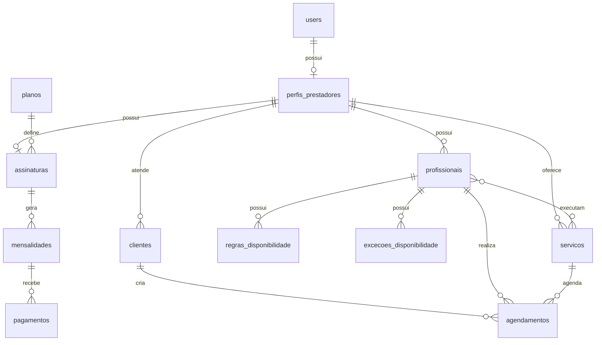

# Arquitetura do inServices

## Visao Geral

O sistema separa responsabilidades por camadas Laravel:

- Controllers mantem apenas orquestracao HTTP.
- Form Requests validam entradas.
- Policies e Middleware protegem autorizacao e isolamento entre prestadores.
- Services concentram regras reutilizaveis.
- Actions executam casos de uso.
- Events, Listeners e Jobs cuidam de tarefas assicronas.
- Models representam o dominio em portugues do Brasil, sem acentos em identificadores.

## Perfis

- Administrador geral: acesso global a planos, prestadores, mensalidades, pagamentos, metricas e auditoria.
- Prestador: gerencia seu perfil publico, servicos, profissionais, clientes e agenda. O isolamento e sempre por `prestador_id`.
- Profissional: pertence a um prestador e possui agenda propria. O MVP nao exige login do profissional, mas a modelagem permite evoluir sem trocar o relacionamento principal.
- Cliente publico: cadastra dados minimos, aceita privacidade e pode ser reconhecido por token persistente de dispositivo.

## Modelagem



## Mensalidades e Acesso

`ServicoAcessoPrestador` centraliza a decisao:

- conta bloqueada ou cancelada suspende imediatamente;
- assinatura ativa ou teste em dia permite acesso;
- mensalidade vencida dentro da tolerancia permite acesso com alerta;
- vencida fora da tolerancia suspende operacao;
- liberacao manual e periodo gratuito prevalecem enquanto validos.

## Agenda e Vagas Simultaneas

`CalcularHorariosDisponiveis` calcula horarios por profissional. Um horario ocupado por Joao nao bloqueia Maria. A sobreposicao deve ser impedida no banco e novamente dentro da transacao de confirmacao.

`AtribuirProfissionalDisponivel` escolhe um profissional ativo vinculado ao servico, disponivel no horario, priorizando quem possui menor numero de agendamentos no mes.

## Cliente Persistente

A tabela `dispositivos_clientes` armazena apenas `token_hash`, validade, user agent e revogacao. O token original deve ir em cookie persistente `HttpOnly`, `SameSite=Lax` e `Secure` em producao.

## WhatsApp

Nao existe chat interno. Links sao gerados no formato:

```text
https://wa.me/{telefone}?text={mensagem_codificada}
```

`ServicoTelefone` normaliza telefones brasileiros com codigo `55` quando necessario.

## PWA e Web Push

O service worker inicial evita cache de areas administrativas, painel, endpoints AJAX e dados pessoais. Web Push esta preparado por `inscricoes_push` polimorficas e eventos futuros com filas.

## Etapas Incrementais

1. Fundacao e modelagem.
2. CRUDs administrativos e prestador.
3. Agendamento publico transacional.
4. Mensalidades automatizadas.
5. Notificacoes, Web Push e Reverb.
6. Relatorios e auditoria avancada.
